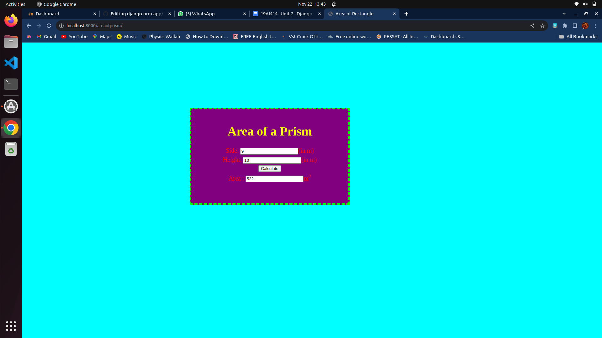

# Design a Website for Server Side Processing

## AIM:
To design a website to perform mathematical calculations in server side.

## Procedure
1. **Creating Repository:**
    - First, a path to make a folder where git needs to be created is identified.
    - Fork the repository (https://github/gowriganeshns/serversideprocessing)
    - Clone the repository
      ```
      git clone https://github.com/Nijeesh-bit/serversideprocessing
      ```
    - After cloning the folder with the repository name django-orm-app will be created

   
2. **Inside django-orm-app:**

      - Write the following commands
        
      ```
      cd serverside
      ```
      
      ```
      django-admin startproj myproj
      ```
      
      - Then move into the folder myproj where manage.py file is located. Now give the commands to create myapp
      ```
      python3 manage.py startapp myapp
      ```
      
      - Then change the necessary settings in the settings.py.
      ```
      from pathlib import Path
      import os
      ```
      ```
      ALLOWED_HOSTS = ['*']
      ```
      ```
      INSTALLED_APPS = [
        'django.contrib.admin',
        'django.contrib.auth',
        'django.contrib.contenttypes',
        'django.contrib.sessions',
        'django.contrib.messages',
        'django.contrib.staticfiles',
        'myapp'
       ]
      ```
      
      ```
      STATICFILES_DIR=[
        os.path.join(BASE_DIR,'static')
       ]
      ```
      ```
      TEMPLATES=[
        'BACKEND':'django.template.backends.django.DjangoTemplates',
        'DIRS':[os.path.join(BASE_DIR,'templates')]
      ]
      ```

      
  
3. **Create a Super User:**
   
       ```
       python3 manage.py makemigrations
       python3 manage.py migrate
       python3 manage.py createsuperuser
       ```
      - Enter the admin and password according to your preferences.
      - You will receive the command Superuser successfully created.
      - Visit the admin app at (http://127.0.0.1:8000/admin) and log in with the superuser account that you have created:

4. **Creating HTML File:**
    - Write the following codes in the terminal to create math.html and result.html
      ```
      mkdir templates
      cd templates
      mkdir myapp
      touch math.html
      touch result.html
      cd..
      ```


4. **Write the code:**
       - Write the given codes in math.html and result.html
   

5. **Run the code:**
        - Make migrations
        ```
           python3 manage.py makemigrations myapp  
           python3 manage.py migrate myapp
        ```
        - In the admin interface (http://127.0.0.1:8000/admin) following web interface will be obtained.
        - Now add 10 employee details having only 5 post.

## PROGRAM

math.html
```
<html>
<head>
<meta charset='utf-8'>
<meta http-equiv='X-UA-Compatible' content='IE=edge'>
<title>Area of Rectangle</title>
<meta name='viewport' content='width=device-width, initial-scale=1'>
<style type="text/css">
body 
{
background-color:cyan;
}
.edge {
width: 1080px;
margin-left: auto;
margin-right: auto;
padding-top: 200px;
padding-left: 300px;
}
.box {
display:block;
border: Thick dashed lime;
width: 500px;
min-height: 300px;
font-size: 20px;
background-color: purple;
}
.formelt{
color: Red;
text-align: center;
margin-top: 5px;
margin-bottom: 5px;
}
h1
{
color: yellow;
text-align: center;
padding-top: 20px;
}
</style>
</head>
<body>
    <div class="edge">
    <div class="box">
    <h1>Area of a Prism</h1>
    <form method="POST">
    
    <div class="formelt">
    Side: <input type="text" name="side" value="{{s}}"></input>(in m)<br/>
    </div>
    <div class="formelt">
    Height: <input type="text" name="height" value="{{h}}"></input>(in m)<br/>
    </div>
    <div class="formelt">
    <input type="submit" value="Calculate"></input><br/>
    </div>
    <div class="formelt">
    Area : <input type="text" name="area" value="{{area}}"></input>m<sup>2</sup><br/>
    </div>
    </form>
    </div>
    </div>
</body>
</html>    
```
result.html
```
<!DOCTYPE html>
<html>
    <head>
        <title>SEC demo on server processing result</title>
    </head>
    <body>
        The result is {{result}}
    </body>
</html>

```
urls.py
```
"""myproj URL Configuration

The `urlpatterns` list routes URLs to views. For more information please see:
    https://docs.djangoproject.com/en/3.2/topics/http/urls/
Examples:
Function views
    1. Add an import:  from my_app import views
    2. Add a URL to urlpatterns:  path('', views.home, name='home')
Class-based views
    1. Add an import:  from other_app.views import Home
    2. Add a URL to urlpatterns:  path('', Home.as_view(), name='home')
Including another URLconf
    1. Import the include() function: from django.urls import include, path
    2. Add a URL to urlpatterns:  path('blog/', include('blog.urls'))
"""
from django.contrib import admin
from django.urls import path
from myapp import views

urlpatterns = [
    path('admin/', admin.site.urls),
    path('areaofprism/',views.prismarea,name="areaofprism"),

]

```
views.py
```
from django.shortcuts import render
from django.template  import loader
from django.shortcuts import render

def prismarea(request):
    context={}
    context['area'] = "0"
    context['s'] = "0"
    context['h'] = "0"
    if request.method == 'POST':
        print("POST method is used")
        s= request.POST.get('side','0')
        h = request.POST.get('height','0')
        print('request=',request)
        print('Side=',s)
        print('Height=',h)
        area = 2*int(s) * int(s) + 4 * int(s)*int(h)
        context['area'] = area
        context['s'] = s
        context['h'] = h
        print('Area=',area)
    return render(request,'myapp/math.html',context)

```

## OUTPUT:
#### HomeP age

#### Server Side Image


## Result:

Sucessfully we have made a Area of Prism calculator through server side processsing.

